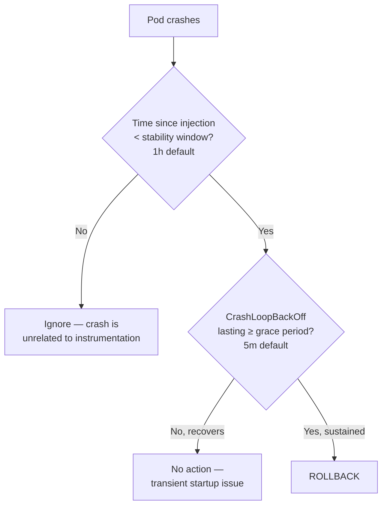
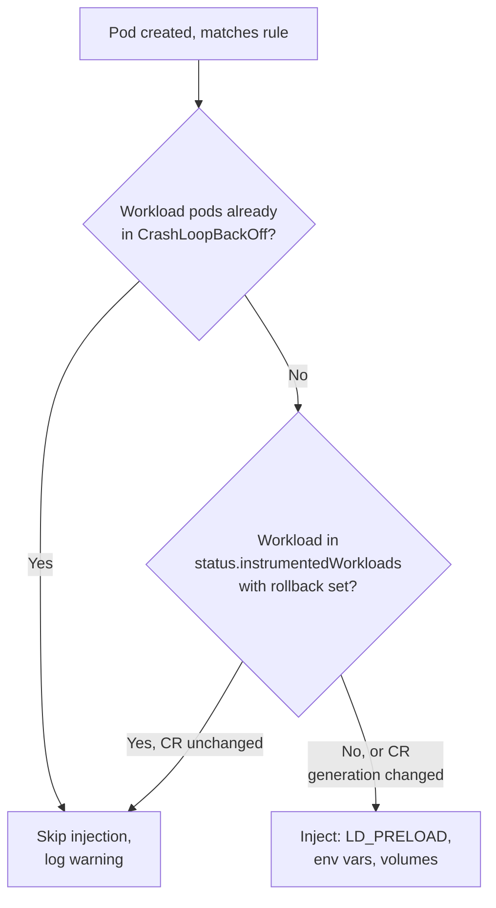
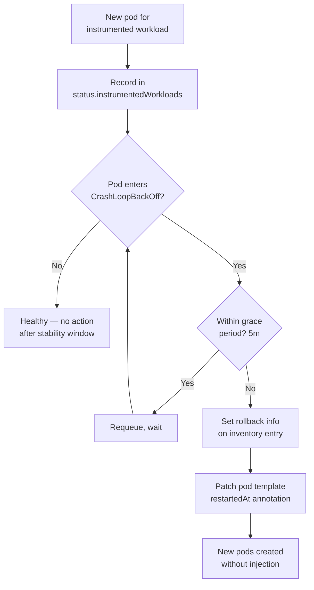
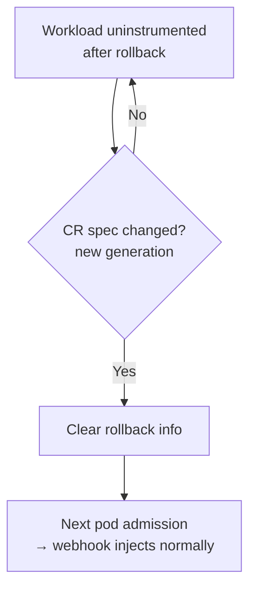

# Crash-loop Auto-recovery

Auto-detect when instrumentation causes a pod to crash-loop and automatically back off. Full design rationale and research in [CRASHLOOP-RECOVERY-DESIGN.md](../CRASHLOOP-RECOVERY-DESIGN.md).

## Timing model



- **Grace period (5m):** How long a pod must be in `CrashLoopBackOff` before we roll back. Avoids reacting to transient startup issues (e.g. waiting for a database).
- **Stability window (1h):** How long after injection we attribute crashes to instrumentation. After this, crashes are assumed unrelated (app bug, OOM, config change).

## Key decisions

| # | Question | Decision |
|---|----------|----------|
| Q1 | Where does rollback state live? | **Status sub-resource on Instrumentation CR** (`status.instrumentedWorkloads[]`) — also serves as instrumentation inventory |
| Q2 | How to undo injection? | Webhook checks rollback state before injecting; controller triggers rollout restart for existing pods |
| Q3 | How to trigger rollout restart? | **`kubectl.kubernetes.io/restartedAt` pod template annotation** — standard k8s mechanism, avoids reimplementing rolling update logic |
| Q4 | How to identify instrumented workloads? | **Instrumentation state DB in CR status** — zero pod/workload manifest changes; controller records state asynchronously, no labels or env var inspection needed |
| Q5 | Timing config scope? | **CR-wide only** (`spec.defaults.rollback`) — 5m grace, 1h stability window. Per-rule overrides deferred (backwards-compatible addition later if needed). Use separate CR with higher priority for workload-specific timing |
| Q6 | How does recovery work? | **Automatic retry on CR spec change** — rollback entry records `crGeneration`; when someone updates the CR (e.g. new agent image), generation increases, controller clears rollback and re-injects. Manual override via `kubectl patch` on status. No time-based retry (same broken agent would just crash again) |
| Q7 | Pre-existing crash protection? | **Yes** — skip injection for workloads already in `CrashLoopBackOff`, log warning |

## Flow diagrams

**Admission (webhook decides whether to inject):**



**Rollback controller (async, watches pods):**



**Recovery:**



## Schema additions

```
InstrumentationSpec
  defaults
    rollback
      enabled           bool              # default true
      graceTime         metav1.Duration   # default 5m
      stabilityWindow   metav1.Duration   # default 1h

InstrumentationStatus
  instrumentedWorkloads []InstrumentedWorkload
    workloadRef
      kind              string            # Deployment, StatefulSet, etc.
      namespace         string
      name              string
    ruleName            string            # which rule matched
    instrumentedAt      metav1.Time       # when injection was first applied
    crGeneration        int64             # CR generation at time of injection
    rollback            *RollbackInfo     # nil if not rolled back
      reason            string            # CrashLoopBackOff, ImagePullBackOff
      rolledBackAt      metav1.Time
```

## Implementation sketch

1. **New controller** (`internal/injector/rollback_controller.go`) — watches pods, maintains `status.instrumentedWorkloads[]` inventory, detects `CrashLoopBackOff`, triggers rollback after grace period
2. **Podmutator change** (`internal/injector/inject.go`) — checks rollback state before injecting; skips if rolled back and CR unchanged, re-injects if CR generation changed
3. **Pre-existing crash check** — skip injection for workloads already in `CrashLoopBackOff` (optional, could be v2)
