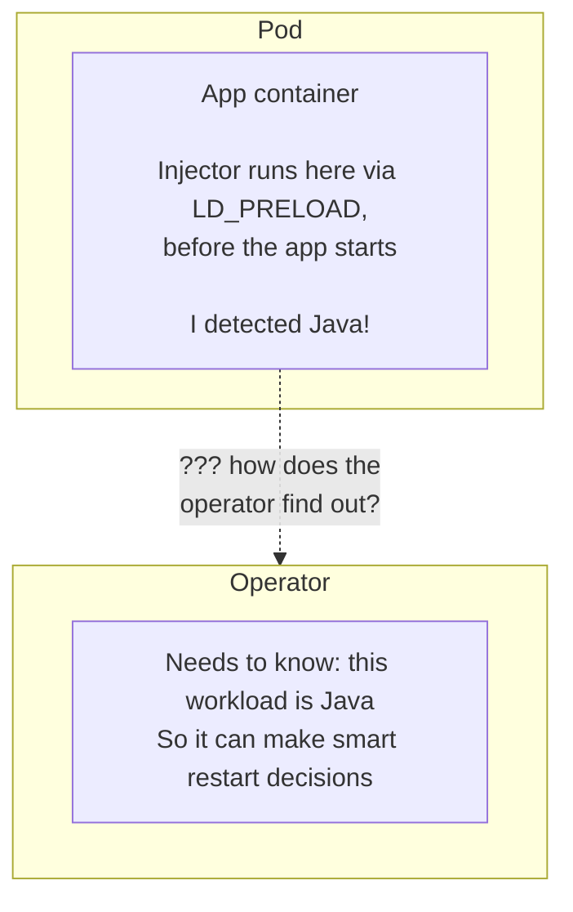
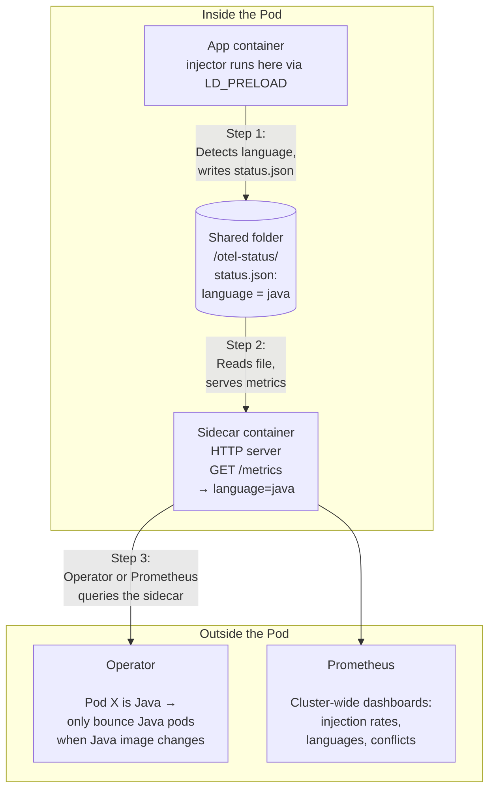
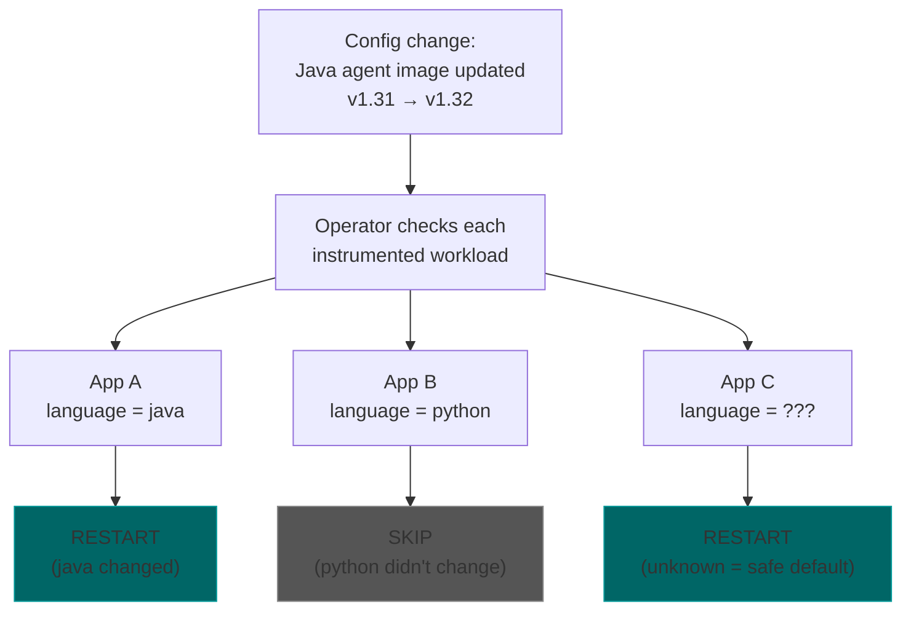

# Instrumentation Status Sidecar

## Problem: the operator is blind after injection

When the operator injects instrumentation into a pod, it doesn't know what language the app is. Language detection happens at **runtime** inside the container (the injector binary inspects the process). The operator only knows it injected "something" — not whether it was Java, Python, Node.js, etc.

This matters for two features:

1. **Selective pod bouncing** — when someone updates the Java agent image in the config, only restart Java workloads, not Python ones. Without language info, we'd restart everything (wasteful).
2. **Observability dashboards** — "how many pods are instrumented per language?", "how often do conflicts occur?" — needs per-pod language data.

## Why is this hard?

The language info lives **inside the container**. Getting data out of a running container is surprisingly limited in Kubernetes:



**Rejected approaches:**

| Approach | Problem |
|----------|---------|
| Container calls Kubernetes API to tag itself | Every pod hits the API server on startup — doesn't scale to thousands of pods |
| Container calls operator directly | The injector runs very early in process startup (before `main()`), networking may not work reliably at that point |
| Operator reaches into container (`exec`) | Requires elevated security permissions (`pods/exec`) — most production clusters won't allow this |
| Write to a shared config file | Kubernetes config mounts are read-only from inside the container |

## Solution: a Prometheus-compatible status sidecar

We add a small **sidecar container** to each instrumented pod. The injector writes a status file, the sidecar reads it and serves it over HTTP. The operator (or Prometheus) can then query the sidecar at its own pace.

Think of it like adding a small "status light" to each instrumented pod that anyone can check by asking "what language are you?"

### Step by step



### What the sidecar serves

Standard Prometheus exposition format — any monitoring tool can read it:

```
otel_injector_info{language="java",mode="install",conflict="false"} 1
otel_injector_injection_result{result="success"} 1
```

Extensible — future metrics without protocol changes:
- `otel_injector_config_hash{hash="abc123"}` — did the pod pick up the latest config?
- `otel_injector_conflict_detected{foreign_agent="prometheus-jmx"}` — conflict details
- `otel_injector_agent_version{language="java",version="1.32.0"}` — agent version tracking

### Why a sidecar?

1. **No startup latency** — the injector just writes a file (fast), no network calls during the critical startup path
2. **No elevated permissions** — no `exec`, no API server writes from pods
3. **Scales** — the operator queries pods at its own pace, not under pod-startup pressure
4. **Pull-based** — follows the Prometheus model (scraper pulls, target serves), well-understood and battle-tested

### Sidecar overhead

- **Image:** reuses the injector image (already present) with a `serve` subcommand — no extra download
- **CPU/memory:** idle HTTP server, requests: 1m CPU / 8Mi memory

### Two consumers, one endpoint

**Operator (rollback controller):**
- Already maintains `status.instrumentedWorkloads[]` for each CR
- On CR spec change, scrapes only affected pods (by pod IP) to read `detectedLanguage`
- Selective bounce: if `spec.java` changed, only restart workloads where `language="java"`
- If scrape fails or sidecar not ready, falls back to bouncing the workload (safe default)

**Prometheus (cluster-wide observability):**
- `PodMonitor` selects pods with the `otel-status` port
- Feeds Grafana dashboards: injection success rates, language distribution, conflict frequency
- Operator is NOT in this path — no bottleneck

### Selective pod bouncing flow



### Schema additions

```
InstrumentedWorkload (existing, in status.instrumentedWorkloads[])
  detectedLanguage    string            # "java", "python", etc. — populated from sidecar scrape
```

### Open questions

- **Port choice:** should avoid 4318 (OTLP default) to prevent conflicts if the app runs a collector
- **Multi-container pods:** one sidecar per pod with per-container labels in metrics, or one per container?
- **Opt-out:** should there be a way to disable the sidecar for minimal-footprint environments?
